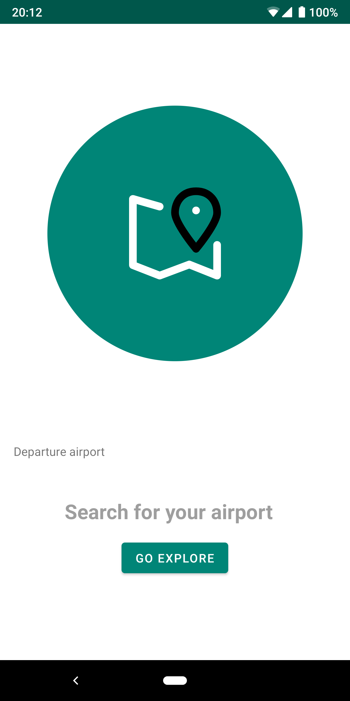
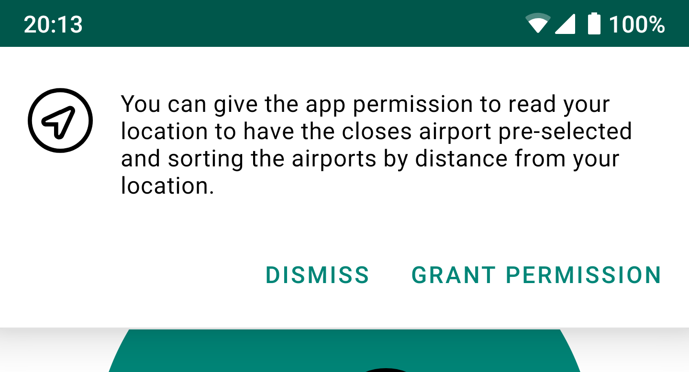
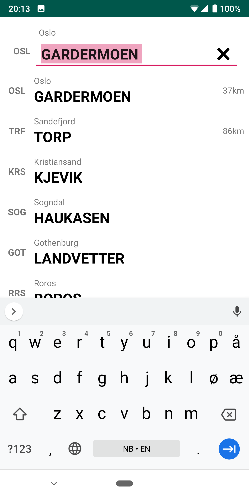
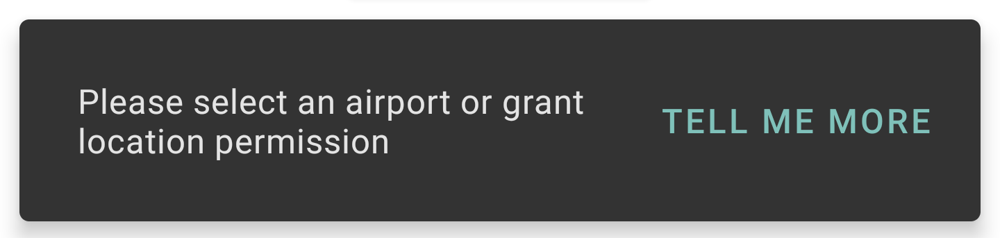
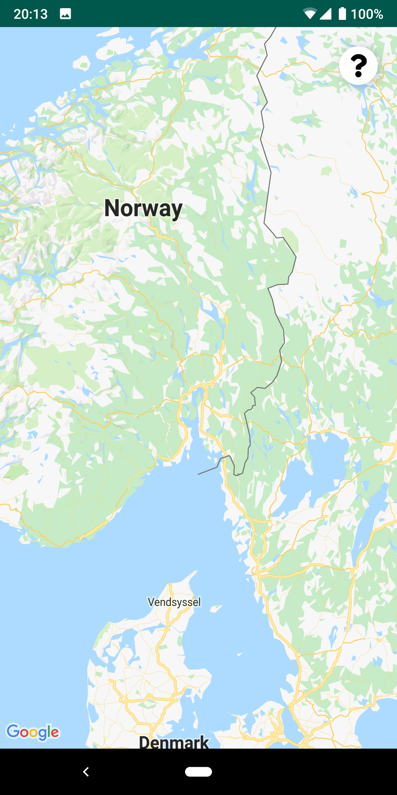
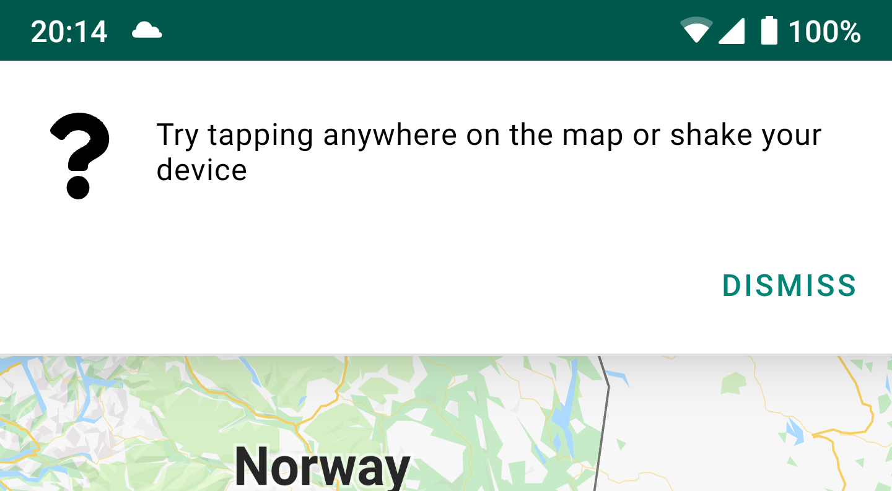
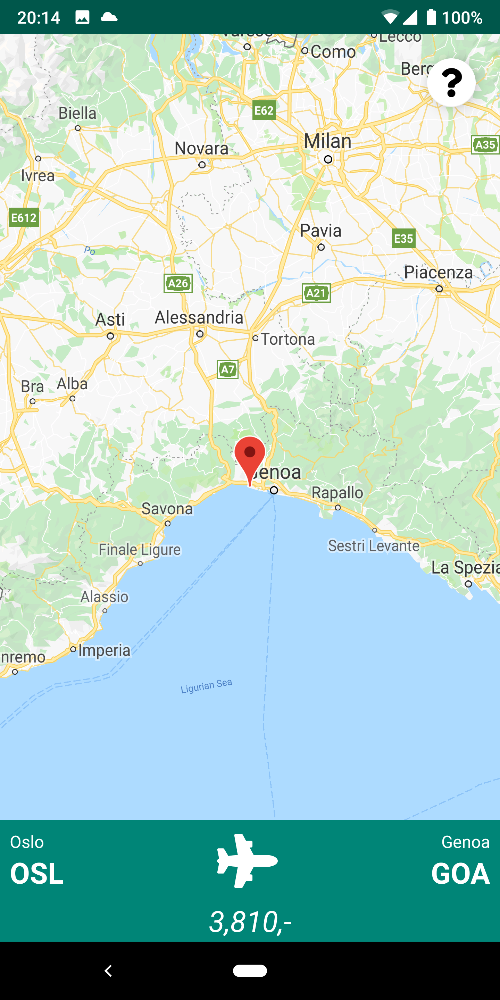
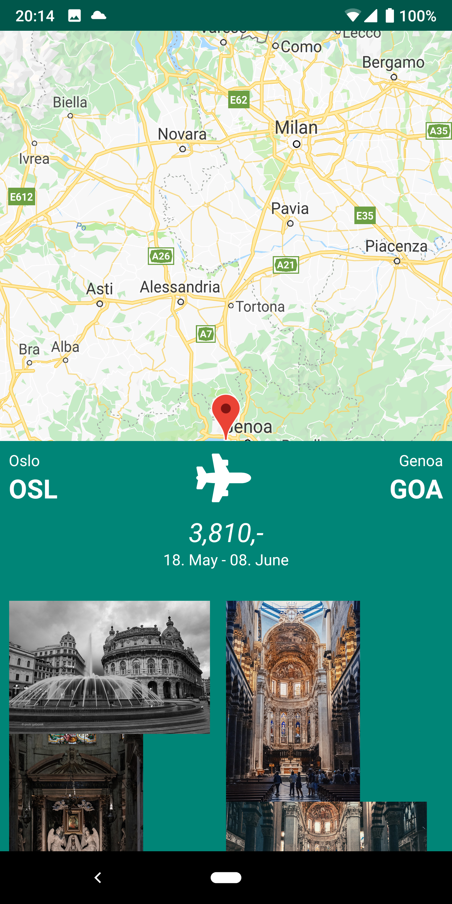

# GetAway

## Focus

As one with more development experience than most(in class), I have focused a lot with finding more challenging ways to implement features. I'm also of the option that the development field is so fast paced, that learning anything other that the latest best practises is often useless as it will have changed multiple times by the time one gets to put the knowledge to use. Therefore I have tried to use a lot of the utilities provided by Google in [Jetpack](https://developer.android.com/jetpack) as well as using the libraries used in real life when applicable such as with RxKotlin for example.

## Concept

The concept of this app is to make it easier to explore, by giving the user ability to point on a map and have the nearest airport with an price estimate showing up.

## Architecture

### Fragment structure / Navigation graph

The app screens is made using only Fragments utilizing the Navigation Component for handling the navigation between screens. Most of the Fragments also utilizes DataBinding.

Navigation Component is mainly used to not have to use FragmentTransactions which is very error-prone, and it gives an easy way to define screens and the transactions between each of the screens. It also provides a type-safe way of accepting arguments when transitioning.

#### Transitions

I have in some parts tried to experiment with some transitions. However it has proven to be not an easy feat, however I got it to work somewhat in two places when pressing the "Search for airport" button, and when sliding the BottomSheet in the map-view.

### Custom Widget

The widget showing the chosen airport and for searching for airports, is a custom View. Which encapsulates the behaviour of enabling and disabling the EditText, and the fact that if you start searching the labels for IATA code and city name is hidden and visible.

## External service

### SAS

Sas does kind of not really have it's own api, the endpoints that I'm using is found by looking at the network calls on their new website. To use another company's "internal"-apis would usually not be a good idea, and if I where to publish the app I would consult with Sas about using their apis. However as an educational project I think it was cool to dig through a website to figure out how to use the api by watching it being used rather than reading some documentation.

### Flickr

I use Flickr's API to find pictures from around the destination airport, by using the latitude and longitude. As well as some tags for when the position gives too few results. Using Flickr isn't really my first choice when coming to photo api's, however it was the only one that had the possibility to search by position.

## Improvements

In the future there is some improvements I would like to do in the application. For example in the BottomSheet in the map-view, the images loaded from Flickr will sometimes disappear and reappear when scrolling causing the images to rearrange.

It would also be cool to allow the user to specify their travel period more specifically, maybe even down to specific days. And add the possibility to get different price estimates for other passenger types that Adults.

## Dependencies

The application is made utilizing most of the latest best practises provided in [Android Architecture Components](https://developer.android.com/topic/libraries/architecture). The app is also using additional third-party libraries.

### Architecture Components

The architecture components used is [Room](https://developer.android.com/topic/libraries/architecture/room), [Navigation Component](https://developer.android.com/guide/navigation), [LiveData](https://developer.android.com/topic/libraries/architecture/livedata), [DataBinding](https://developer.android.com/topic/libraries/data-binding), and [ViewModels](https://developer.android.com/topic/libraries/architecture/viewmodel).

#### Room

Room is a persistence library made by Google as a part of it's Architecture components, and provides a abstraction layer on top of SQLite which is the Database driver that comes with android.

In this project I use it to store the data about the different airports, this is mainly to keep the app from having to keep all of that information in memory when running the app.

#### Navigation component

Navigation component gives an much better developer experience compared to handing FragmentTransitions and Intents manually. It allows you to define a navigation graph, and the possible transitions between different activities or fragments. It also gives a type-safe way to send arguments between fragments or activities.

#### LiveData

LiveData gives some of the same benefits as other reactive streaming libraries (ie. RxJava), with the advantage of being lifecycle-aware. This means that a LiveData object will only call your observer callback when the associated lifecycle-owner(activity or fragment) is active.

#### DataBinding

DataBinding allows you to offset some of the work associated with updating values displayed or passed to a View, and together with LiveData can allow you to not have to reference any views in your code.

There is also the possibility of two-way data binding, this allows you to interface with a data object instead of interfacing with the view. This allows for very clean and decoupled code.

#### ViewModels

ViewModels does not do much in itself, but the concept is that it holds the data in the application. And the main reason to use it, is that it will survive across lifecycle changes such as when the phone rotates. And the ViewModels can be shared across fragments, so it could store common information needed throughout the application.

### Third-party libraries

In modern programming you will rarely not use any third-party libraries, and Android development is no exception. In this project I might be using more advanced libraries than necessary for an app of this scope. However of the libraries most enables certain features not present in any utilities provided by Google as a part of it's featured set of tools.

In this project I'm using [RxKotlin](https://github.com/ReactiveX/RxKotlin), [RxRecyclerAdapted](https://github.com/ahmedrizwan/RxRecyclerAdapter), [Insert-Koin](https://insert-koin.io/), [Gson](https://github.com/google/gson), [Picasso](http://square.github.io/picasso/), [Retrofit](https://square.github.io/retrofit/), and [Anko](https://github.com/Kotlin/anko).

#### RxJava/RxKotlin

RxKotlin is just a wrapper library around RxJava, which adds some of the kotlin specific features to the library. RxJava is a library which makes asynchronous programming easier by building it on observable streams.

I use this library just to ease the handling of asynchronous observable data that doesn't play nice with the constraint of being bound to a lifecycle-owner found in LiveData. In addition to RxJava/RxKotlin being industry-standard when developing Android apps.

#### RxRecyclerAdapter

RxRecyclerAdapter is again a fairly simple library, it uses RxKotlin and DataBinding to make the creation of a RecyclerViewAdapter and ViewHolder much easier. And since it's based on RxKotlin everything is asynchronous and observer-driven.

#### Insert-Koin 

Insert-Koin is a dependency-injection library made for Kotlin, it manages dependencies across modules as every other dependency-injection library. This is usually not used in so small and simple apps, but I really like the way it takes care of ViewModels by injecting it into Fragments that needs them.

#### GSON

GSON is a small JSON serialization and deserialization library from Google, which is commonly used in any Java or Kotlin application. 

#### Picasso

Pisasso is a very tiny library, that only does the job of downloading images for use in the GUI. This is something that also is fairy common to utilize and gives an clean and easy way to manage an otherwise, mildly annoying thing of downloading images.

#### Retrofit

Retrofit is a small library which provides an easier way to interact with APIs, in this project I'm using a GSON plugin so it will automatically deserialize the data to kotlin object, as well as I'm using a plugin which makes retrofit return RxJava type observables.

Retrofit is a library commonly used in the wild, and with the easy integration with both GSON for json deserialization and RxJava for returning responses as an observable stream. 

#### Anko

Anko is a small utility library for developing android apps in Kotlin, and is made by the creators of Kotlin, JetBrains. In this app I'm only using it to run code off the main thread by using `doAsync { /* code */ }`.

## Screenshots

### Start screen

### Rationale for location permission

### Airport search

### Warning when not selected airport

### Map view

### Info banner - Map view

### Selected airport - Map view

### Selected airport expanded - Map view

